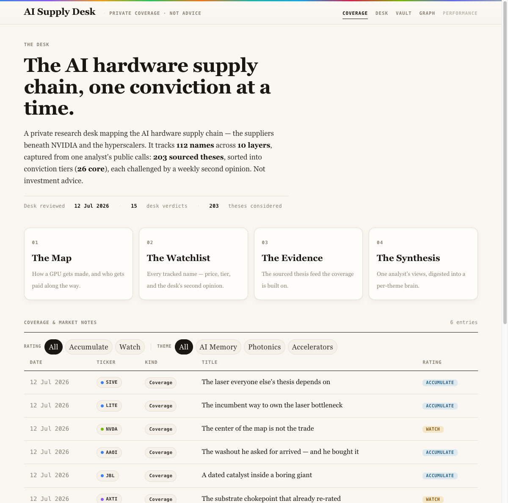
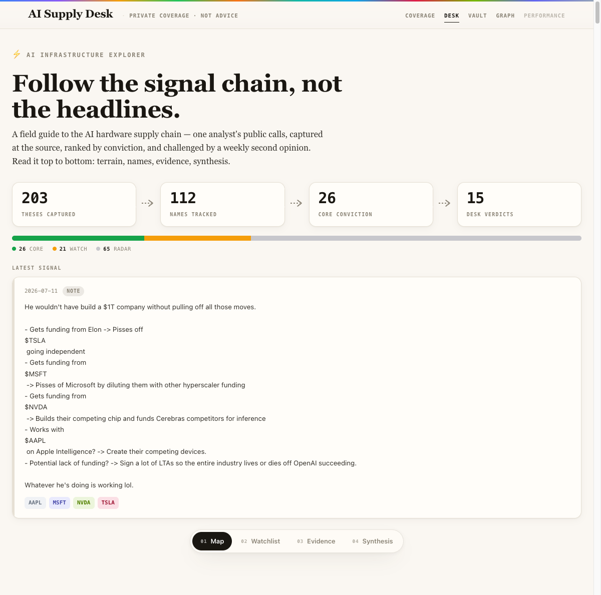
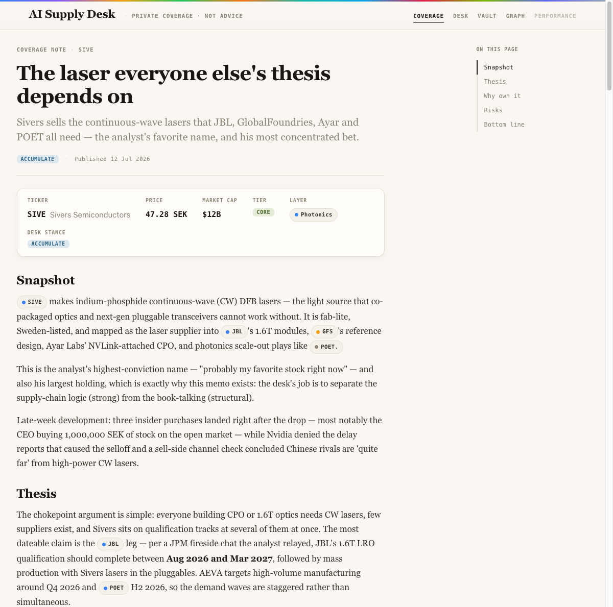
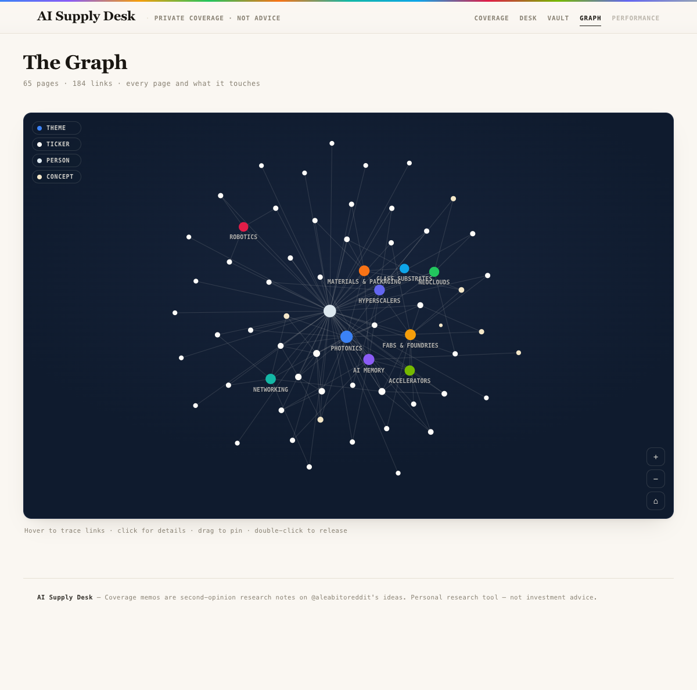

# ⚡ AI Infrastructure Explorer

A personal research page that maps the **AI hardware supply chain** — who
NVIDIA and the big tech companies actually depend on to build and run AI
chips (laser makers, memory makers, chip factories, cloud providers, and so
on). It also keeps a running, sourced log of one analyst's stock ideas, plus
a weekly "second opinion" from Claude on the names that matter most.

> Personal project, just for me. Not investment advice.

## 🚀 Quick start
**Just open the app:** double-click **`desk.html`** — the Desk is the front
door (map, watchlist, evidence, synthesis). "Coverage" in the top nav is the
memo index. It works completely offline — no internet, no server, nothing to
install. Everything it shows lives in one file, `data.js`; the shared look
and helpers live in `shared/`.

**Backend chores** (capture bot, prices, local server, status): double-click
**`desk.command`** and pick from the menu. For the full story read
**[docs/GUIDE.md](docs/GUIDE.md)** — it also answers the #1 question people
ask: *"I messaged the bot and nothing replied — why?"*

## What it does
It's a small multi-page site (plain HTML — every page opens by double-click):

- **The front page** (`index.html`) — a short editorial cover: what the desk
  is, the live counts, when it was last reviewed, plus the **coverage ledger**
  — every research memo the desk has written, filterable by kind and rating.
- **The field guide** (`desk.html`) — one long scrolling page, not a set of
  separate tabs. At the top: a quick summary (how many ideas captured, how many
  names tracked, the newest signal). Scroll down through four chapters, followed
  everywhere by a floating pill-shaped nav bar so you can jump around:
- **01 · The Map** — the supply chain laid out visually: who supplies →
  what NVIDIA makes → who buys it. Click any piece to see what to watch and
  which companies sit there.
- **02 · The Watchlist** — a sortable table of every tracked stock: price,
  how it moved this week/month, market cap, and your own rating. Opens
  already narrowed to the highest-conviction names so it isn't overwhelming.
- **03 · The Evidence** — the actual source posts, kept as receipts. Only
  the 10 most recent show by default; older ones are one click away.
- **04 · The Synthesis** — Claude reads all the evidence and writes one
  short summary per theme: what the story is, how confident, which stocks
  matter.
- **Coverage memos** (`memo.html`) — full research notes on the
  highest-conviction names: thesis, why own it, risks, bottom line, with the
  source posts cited underneath and live price/tier/stance pulled in at the top.
- **The Vault** (`vault.html`) — an Obsidian-style knowledge base: one page
  per company, theme, and concept, cross-linked with `[[wikilinks]]` and
  backlinks — plus a **Graph view** that draws the whole web as an
  interactive force-directed map (hover to trace, click for details).
- **Performance** (`performance.html`) — the desk's track record: every
  dated call with its entry price, current return, and whether it beat
  simply buying the SMH semiconductor index that day. Stamped forward-only,
  never back-dated; the nav link stays greyed until 3 real calls exist.

## 📚 Which doc do I open?

| I want to... | Open this |
|---|---|
| Just use the app | Nothing — double-click `index.html` |
| Add a new idea, refresh prices, or fix "the bot isn't replying" | [docs/GUIDE.md](docs/GUIDE.md) |
| Remember why this project exists and what it's supposed to do | [docs/PRD.md](docs/PRD.md) |
| See what's built, what's coming next, and known issues | [docs/ROADMAP.md](docs/ROADMAP.md) |
| Set up the Telegram bot for the first time | [docs/TELEGRAM_SETUP.md](docs/TELEGRAM_SETUP.md) |

Everything else you'll see in this repo (`CLAUDE.md`, `docs/DESIGN.md`,
`ingest/README.md`, `.claude/skills/*`, `docs/superpowers/specs/*`) is
technical reference that Claude Code reads on its own when it works on the
project — you don't need to open those unless you're curious.

## 🗺️ Where things live
```
ai-supply-desk/
├── desk.html           THE DESK (front door) — map, watchlist, evidence, synthesis
├── index.html          COVERAGE — the memo ledger (+ the week's Focus card)
├── memo.html           COVERAGE MEMOS — full research notes per name (?ticker=)
├── vault.html          THE VAULT — knowledge base, List/Graph views (?view=graph)
├── performance.html    THE TRACK RECORD — dated calls vs the SMH benchmark
├── design.html         DESIGN REFERENCE — live style guide (not in the nav; open directly)
├── desk.command        BACKEND MENU — double-click: start bot / prices / serve / status
├── shared/             the shared look + helpers used by every page
│   ├── theme.css        design tokens + components
│   └── common.js        shared logic (window.AIE)
├── data.js             all the data the app shows — auto-generated, don't hand-edit
├── README.md           you are here
├── CLAUDE.md           technical build notes (for Claude Code — not needed for everyday use)
├── docs/
│   ├── GUIDE.md         ⭐ how to run everything + troubleshooting
│   ├── PRD.md           what this project is trying to do, and why
│   ├── ROADMAP.md       what's done / what's next
│   ├── DESIGN.md        the visual design reference
│   ├── TELEGRAM_SETUP.md  → pointer into GUIDE.md
│   └── images/          screenshots
└── ingest/              THE BACKEND — the tools that update data.js
    ├── bot.py            the Telegram bot that captures new ideas
    ├── synthesize.py     writes the "Synthesis" summaries
    ├── fetch_prices.py / serve.py   weekly price updates + local server
    ├── parser.py  scorer.py  fetcher.py  review.py  generate_data_js.py
    ├── store/*.json      the actual saved data (tickers, ideas, summaries, …)
    ├── tests/             automated checks (python3 -m unittest discover -s ingest/tests)
    ├── .env.example       copy to .env, add your own keys (never shared/committed)
    └── requirements.txt
```

## How the two halves fit
- **The app** (`index.html` + `desk.html`, sharing `shared/theme.css` +
  `shared/common.js`, all reading `data.js`) is what you actually look at — it
  opens in your browser and always works, just by opening the file.
- **The backend** (everything in `ingest/`) is a set of small tools you run
  yourself, only when you want to update something — capture a new idea,
  refresh prices, or get a fresh AI summary. The Telegram bot only replies
  while `python3 ingest/bot.py` is running in a terminal on your Mac. See
  [docs/GUIDE.md](docs/GUIDE.md) for exactly how.

## What it's built with
- Plain HTML/CSS/JavaScript — no frameworks, no build tools, nothing to
  install just to use it.
- Works completely offline by double-clicking `index.html`.
- Your keys/tokens live only in a private file (`ingest/.env`) that's never
  shared or uploaded anywhere.

## Where things stand
**The "Private Coverage" upgrade is complete** (all phases, Jul 2026): the
warm editorial front page with its coverage ledger, the field guide (map /
watchlist / evidence / synthesis), full coverage memos, the knowledge vault
with its interactive graph view, site-wide cross-linking, and the
forward-only performance ledger. Currently tracking 110+ companies, 200+
captured ideas, 15 desk verdicts, and 6 coverage memos. See
[docs/EXECUTION.md](docs/EXECUTION.md) and [docs/ROADMAP.md](docs/ROADMAP.md)
for the full history.

## Screenshots

| The front page | The field guide |
|---|---|
|  |  |

| A coverage memo | The knowledge graph |
|---|---|
|  |  |

## License
All rights reserved. No open-source license is granted at this time.
